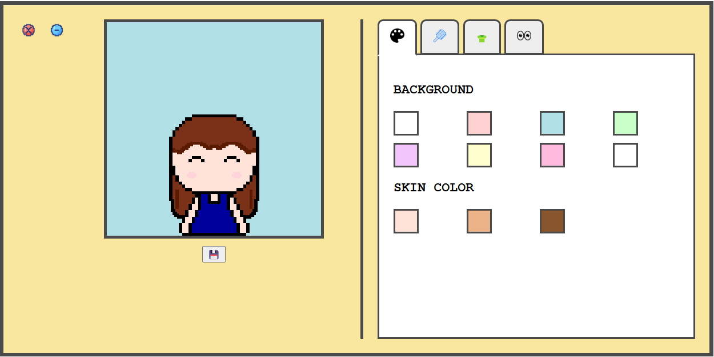

👗 Dressing Game

A fun and interactive dress-up game built using HTML, CSS, and JavaScript.
Players can mix and match different clothing items to style a character and create unique outfits.

🔗 Live Demo: [Play the Game](https://jihad-n.github.io/dressing_game/)

🎮 Features
🧥 Multiple clothing options (tops, bottoms, accessories, etc.)
🎨 Interactive UI for selecting and switching outfits
⚡ Smooth and responsive design
💡 Simple and beginner-friendly game logic
🌐 Runs directly in the browser (no installation required)
🛠️ Technologies Used
HTML5 – Structure of the game
CSS3 – Styling and layout
JavaScript (Vanilla JS) – Game logic and interactivity

## 📸 Screenshot

